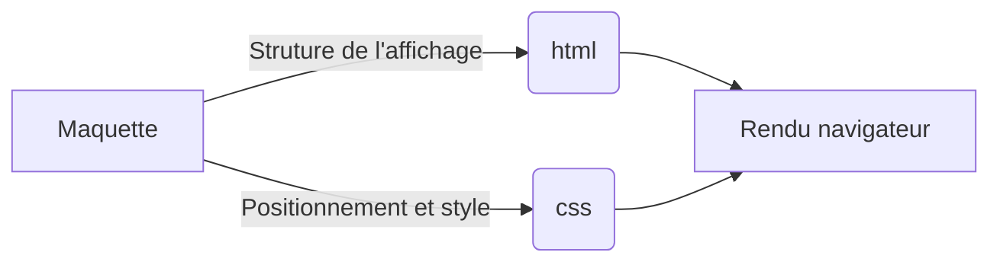

# Projet numéro 2 : Reservia
## Exercice
- Intégrer du contenu conformément à une maquette
- Utiliser un système de gestion de versions pour le suivi du projet et son hébergement
- Implémenter une interface responsive
## Démarche

> Lancer index.html pour afficher la page
> Redimensionner l'écran pour constater l'adaptation de l'affiche
